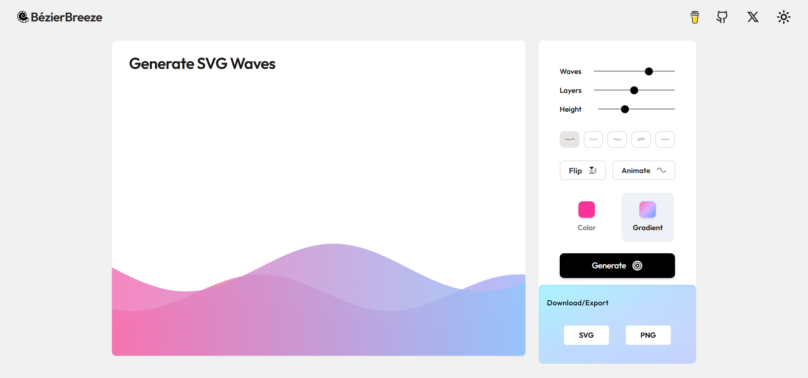
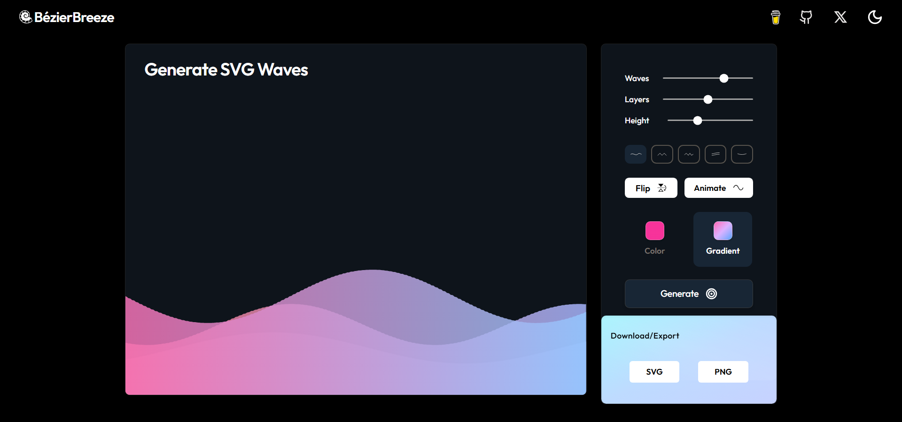

<p align="center">
  
</p>

<h1 align="center">BézierBreeze</h1>

<p align="center">
  A smooth SVG wave generator built with React.
Create layered, customizable wave backgrounds using cubic Bezier curves.
Adjust intensity, layers, shapes, colors, and gradients — then export as SVG, PNG, or raw code.
</p>


<p align="center">
  <a href="https://bezierbreeze.vercel.app">
    
  </a>
</p>

<p align="center">
  
  
</p>

## What is BézierBreeze?

**BézierBreeze** is a free, open‑source SVG wave generator built with React. It uses smooth cubic Bézier curves to create layered, customisable wave patterns that you can use for website headers, backgrounds, dividers, or any design project.

Adjust the intensity, number of layers, and height of your waves with simple sliders. Choose from five different wave shapes (sine, square, triangle, sawtooth, random), flip individual layers, and even animate the waves for a live preview. Every wave can be filled with a solid colour or a gradient, and you can export your creation as an SVG file, a PNG image, or copy the raw SVG code to your clipboard.

No sign‑ups, no ads, no servers – everything runs directly in your browser.


## Features

**Wave Intensity**
A single slider controls the overall "waviness" (0–100%).
At 0% the waves are completely flat; at 100% they reach their full amplitude.

**Multiple Layers**
Add up to 5 independent wave layers.
Each layer can have its own shape, color, gradient, flip state, and animation.

**Height Control**
Adjust the SVG canvas height (200–800 px) without affecting the surrounding layout.

**Five Wave Shapes**
- Sine: smooth continuous curve
- Square: sharp digital edges
- Triangle: geometric peaks
- Sawtooth: jagged energetic lines
- Random: unpredictable organic pattern

**Flip**
Each layer can be flipped vertically, creating mirrored effects or alternating wave directions.

**Animate**
Enable real-time phase animation to visualize how the waves move over time.

**Solid and Gradient Fills**
Each layer supports:
- Solid color (color picker)
- Two-stop linear gradient (start and end color pickers)

**Randomize**
The "Generate" button randomizes all parameters (amplitudes, frequencies, phases, colors, and wave intensity) to produce a new design instantly.

**Export Options**
- SVG file download
- PNG file download (at the current canvas size)

**Live Preview**
All changes are rendered immediately in the preview panel.

---

## How It Works

The wave generator constructs an SVG document programmatically using JavaScript.
For each layer, a series of points is calculated along the x‑axis using a selected waveform function (sine, square, etc.).
These points are then connected with cubic Bezier curves to create a smooth, continuous path.

The path is closed to the bottom of the canvas, filled with the selected color or gradient, and combined with other layers.
The final SVG string is injected into the preview area and can be exported.

---

## Tech Stack

| Technology | Purpose |
|------------|---------|
| React 19   | User interface |
| Tailwind CSS v4 | Styling |
| Vite 6     | Build tool & development server |
| Lucide React | Icons |
| Custom SVG/Bezier math | Wave generation logic |

---

## Getting Started

### Prerequisites

- Node.js 18 or later
- npm (or yarn/pnpm)

### Installation

```bash
# Clone the repository
git clone https://github.com/byllzz/bezier-breeze.git

# Navigate to the project directory
cd bezier-breeze

# Install dependencies
npm install

# Start the development server
npm run dev
```
The app will be running at `http://localhost:5173.`


---

<p align="center"> Made with 💜 using React, Tailwind CSS, and a little math.<br /> <strong>Let your backgrounds flow. 🌊</strong> </p><p align="center"> © 2026 BézierBreeze - Open Source MIT </p>
